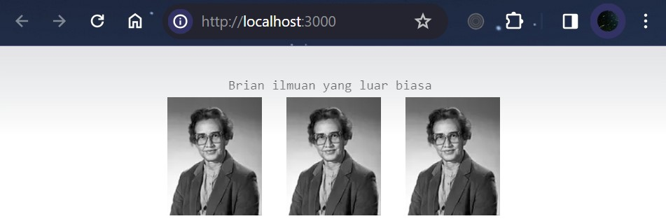
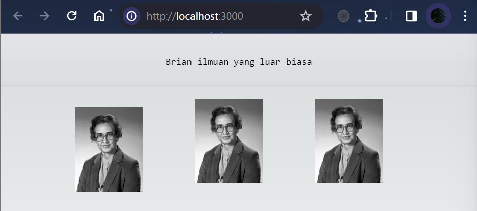
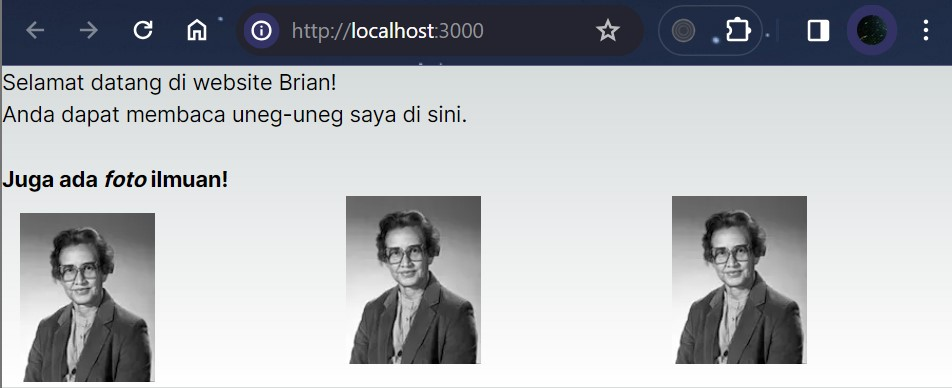
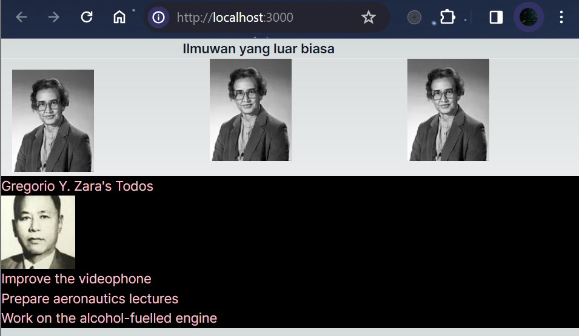
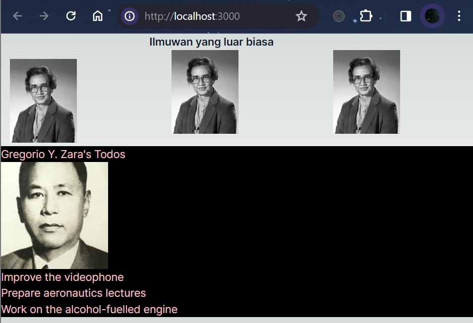
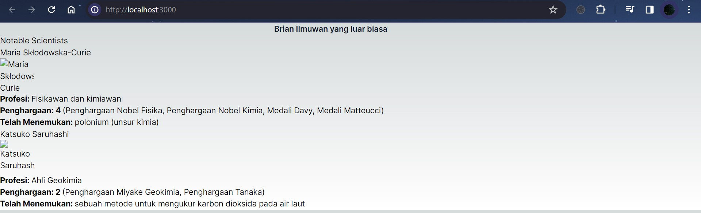
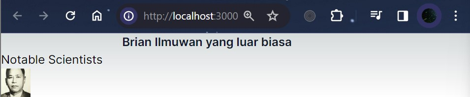

### Nama : Brian Mohamad Safiudin
### NIM : 2141720133
### Kelas : TI-3A
---

# Praktikum 1: Mendefinisikan Komponen

`Komponen React` adalah fungsi JavaScript biasa, tetapi nama mereka harus dimulai dengan huruf kapital atau tidak akan berfungsi!

## Soal 1
#### Ubah isi kode Home() sehingga dapat tampil seperti berikut dengan memanfaatkan komponen Profile() yang tadi sudah dibuat dari langkah 1 tersebut!

```tsx
import Profile from "../components/profile";

export default function Home() {
  return (
    <main className="flex min-h-screen flex-col items-center justify-between p-24">
      <div className="z-10 max-w-5xl w-full items-center justify-between font-mono text-sm lg:flex">
        <p className="fixed left-0 top-0 flex w-full justify-center border-b border-gray-300 bg-gradient-to-b from-zinc-200 pb-6 pt-8 backdrop-blur-2xl dark:border-neutral-800 dark:bg-zinc-800/30 dark:from-inherit lg:static lg:w-auto  lg:rounded-xl lg:border lg:bg-gray-200 lg:p-4 lg:dark:bg-zinc-800/30">
          Brian ilmuan yang luar biasa&nbsp;
        </p> 
        <div className="fixed top-0 left-0 flex h-48 w-full items-end justify-center bg-gradient-to-t from-white via-white dark:from-black dark:via-black lg:static lg:h-auto lg:w-auto lg:bg-none">
          <Profile />
          <Profile />
          <Profile />
        </div>
      </div>
    </main>
  );
}
```


- `import Gallery from './Gallery';` Penulisan impor seperti ini './Gallery.tsx' atau './Gallery' akan tetap berfungsi dengan React, meskipun yang pertama lebih mirip dengan bagaimana native ES Modules bekerja.

- Anda tidak dapat memiliki dua `default exports` dalam satu file. Anda dapat membuat file baru dengan default exports, atau Anda dapat menambahkan sebuah named exports untuk komponen lain dalam satu file. Sebuah file hanya dapat memiliki satu default exports, tapi dapat memiliki banyak named exports.

- Untuk mengurangi potensi kebingunan antara `default `dan `named exports`, beberapa tim memilih untuk berpegang pada satu gaya penulisan (default atau named), atau menghindari mencampurnya dalam satu file. Maka pilihlah kebiasaan terbaik untuk Anda!

---

# Praktikum 2: Mengimpor dan Mengekspor Komponen

## Soal 2
#### Capture hasilnya dan buatlah laporan di README.md. Jelaskan apa yang telah Anda pelajari dan bagaimana tampilannya saat ini?

```tsx
import { Gallery } from "@/components/gallery";

export default function Home() {
  return (
    <main className="flex min-h-screen flex-col items-center justify-between p-24">
      <div className="z-10 max-w-5xl w-full items-center justify-between font-mono text-sm lg:flex">
        <p className="fixed left-0 top-0 flex w-full justify-center border-b border-gray-300 bg-gradient-to-b from-zinc-200 pb-6 pt-8 backdrop-blur-2xl dark:border-neutral-800 dark:bg-zinc-800/30 dark:from-inherit lg:static lg:w-auto  lg:rounded-xl lg:border lg:bg-gray-200 lg:p-4 lg:dark:bg-zinc-800/30">
          Brian ilmuan yang luar biasa&nbsp;
        </p> 
        <Gallery />
      </div>
    </main>
  );
}
```


- `import { Gallery } from "@/components/gallery";` Ini adalah pernyataan import yang mengimpor komponen Gallery dari lokasi relatif "@/components/gallery". Lokasi @ mungkin merupakan konvensi untuk root direktori proyek.

- `JSX dan React` adalah dua hal yang berbeda. Mereka masing-masing digunakan secara bersama, namun anda dapat menggunakannya sendiri secara independen.JSX merupakan ekstensi sintaks, sedangkan React adalah library JavaScript.

- Umumnya, pesan error pada React akan memandu anda mencari sumber masalah yang ada di kode. `Jangan lupa membaca pesan error` jika anda stuck!

- `JSX mirip dengan HTML`, namun di balik layar, mereka berubah menjadi objek literal JavaScript. Anda tidak bisa mengembalikan dua objek dari sebuah fungsi tanpa membungkus mereka ke sebuah senarai. Inilah mengapa anda juga tidak bisa mengembalikan dua tag JSX tanpa membungkus mereka menjadi sebuah fragment.

- Untuk beberapa alasan, atribut `aria-*` dan `data-*` ditulis menggunakan tanda minus.

## Soal 3
#### Silakan perbaiki kode JSX. Anda boleh menggunakan konverter atau perbaiki secara manual.

```tsx
import { Gallery } from "@/components/gallery";

export default function Bio() {
  return (
    <div className="intro">
      <h1>Selamat datang di website Brian!</h1>
      <p className="summary">
        Anda dapat membaca uneg-uneg saya di sini.
        <br/><br/>
        <b>Juga ada <i>foto</i> ilmuan!</b>
        <Gallery />
      </p>
    </div>
  );
}
```


- Error yang terjadi karena `kesalahan dalam struktur JSX` pada fungsi Bio().
- `Penempatan elemen <p> di luar dari elemen <div>` yang mengakibatkan struktur JSX tidak valid. Dalam JSX, setiap elemen harus dibungkus oleh satu elemen induk atau elemen pembungkus terluar.
- `Penutupan tag bold dan italic (<b> dan <i>) tidak sesuai urutan yang benar`, sehingga tidak valid secara sintaksis dalam HTML.

- Properti style dalam bentuk inline ditulis menggunakan `gaya camelCase di dalam JSX`. Sebagai contoh, jika pada HTML Anda menuliskan < ul style="background-color: black" >, maka pada komponen React Anda harus menulisnya seperti ini < ul style={{ backgroundColor: 'black' }} >.

---

# Praktikum 3: Menggunakan JSX dinamis

## Soal 4
#### Kode masih terdapat error, silakan diperbaiki.

```tsx
const person = {
  name: 'Gregorio Y. Zara',
  theme: {
    backgroundColor: 'black',
    color: 'pink'
  }
};

export default function TodoList() {
  return (
    <div style={person.theme}>
      <h1>{person.name}&apos;s Todos</h1>
      
      <ul>
        <li>Improve the videophone</li>
        <li>Prepare aeronautics lectures</li>
        <li>Work on the alcohol-fuelled engine</li>
      </ul>
    </div>
  );
}
```
- Perubahan yang dilakukan adalah mengganti` {person}` dengan `{person.name}` di dalam tag h1, karena kita ingin menampilkan nama dari objek person. Kemudian mengganti tanda kutip tunggal `"'"` sebelum s Todos dengan `&apos`;.

## Soal 5
#### Buka file src/components/todolist.tsx lakukan ekstrak URL gambar ke dalam objek person.
#### Capture hasilnya dan buatlah laporan di README.md. Apakah ada perbedaan pada tampilan web saat ini?

```tsx
import { Gallery } from "@/components/gallery";
import TodoList from "@/components/todolist";

export default function Home() {
  return (
    <section>
      <h1 className="font-semibold text-slate-900 truncate pr-20 text-center">Ilmuwan yang luar biasa</h1>
      <hr />
      <Gallery />
      <hr />
      <TodoList />
    </section>
  );
}
```


- Perbedaan dalam tampilan web saat ini, menampilkan dua komponen: `Gallery` dan `TodoList`

## Soal 6
#### Perbaiki kode tersebut pada bagian atribut src. Kode lainnya dapat Anda sesuaikan dari jawaban soal sebelumnya. Capture hasilnya dan buatlah laporan di README.md. Jelaskan apa yang telah Anda pelajari dan bagaimana tampilannya saat ini?
#### Untuk memeriksa apakah perbaikan Anda berhasil, coba ubah nilai dari imageSize menjadi 'b'. Gambar harus menyesuaikan ukuran setelah diubah.

```tsx
const baseUrl = 'https://i.imgur.com/';
const person = {
  name: 'Gregorio Y. Zara',
  imageId: '7vQD0fP',
  imageSize: 'b',
  theme: {
    backgroundColor: 'black',
    color: 'pink'
  }
};

export default function TodoList() {
  return (
    <div style={person.theme}>
      <h1>{person.name}&apos;s Todos</h1>
      
      <ul>
        <li>Improve the videophone</li>
        <li>Prepare aeronautics lectures</li>
        <li>Work on the alcohol-fuelled engine</li>
      </ul>
    </div>
  );
}
```


- Dalam kode di atas, saya menggunakan `tanda kutip backtick ()` untuk membungkus string yang mengandung ekspresi JavaScript, dan saya menggabungkan variabel baseUrl, person.imageId, dan person.imageSizeke dalam string menggunakan${}`.

- Perbedaan dalam tampilan web saat ini, gambar menyesuaikan ukuran setelah diubah.

- Jika dobel kurung kurawal setelah person= membuat Anda bingung, ingatlah bahwa `mereka hanyalah sebuah objek` dalam kurung kurawal JSX.

---

# Praktikum 4: Menggunakan Props

## Soal 7
#### Jika kode terdapat error, silakan diperbaiki.
#### Komponen MyGallery ini berisi dua markup yang sama persis. Ekstraklah menjadi komponen MyProfile untuk mengurangi duplikasi. Anda perlu memilih props apa saja yang akan dikirimkan.
#### Capture hasilnya dan buatlah laporan di README.md. Jelaskan apa yang telah Anda pelajari dan bagaimana tampilannya saat ini?

```tsx
interface ProfileProps {
  name: string;
  imageUrl: string;
  profession: string;
  awards: string[];
  discovery: string;
}

const MyProfile: React.FC<ProfileProps> = ({ name, imageUrl, profession, awards, discovery }) => {
  return (
    <section className="profile">
      <h2>{name}</h2>
      
      <ul>
        <li>
          <b>Profesi: </b> 
          {profession}
        </li>
        <li>
          <b>Penghargaan: {awards.length} </b> 
          ({awards.join(', ')})
        </li>
        <li>
          <b>Telah Menemukan: </b>
          {discovery}
        </li>
      </ul>
    </section>
  );
}

export default MyProfile;
```

```tsx
import MyProfile from './myprofile';

const MyGallery = () => {
  return (
    <div>
      <h1>Notable Scientists</h1>
      <MyProfile
        name="Maria Skłodowska-Curie"
        imageUrl='szV5sdG'
        profession="Fisikawan dan kimiawan"
        awards={[
          "Penghargaan Nobel Fisika",
          "Penghargaan Nobel Kimia",
          "Medali Davy",
          "Medali Matteucci"
        ]}
        discovery="polonium (unsur kimia)"
      />
      <MyProfile
        name="Katsuko Saruhashi"
        imageUrl='YfeOqp2'
        profession="Ahli Geokimia"
        awards={[
          "Penghargaan Miyake Geokimia",
          "Penghargaan Tanaka"
        ]}
        discovery="sebuah metode untuk mengukur karbon dioksida pada air laut"
      />
    </div>
  );
}

export default MyGallery;
```


- Dalam kode di atas, saya menggunakan `interface` untuk mendefinisikan tipe data dari props yang akan digunakan dalam komponen MyProfile.

- Saya menggunakan `React.FC` untuk mendefinisikan tipe dari props yang akan digunakan dalam komponen MyProfile.

- Saya menggunakan `props` untuk mengirimkan data dari komponen MyGallery ke komponen MyProfile.

- Perbedaan dalam tampilan web saat ini, menampilkan dua komponen: `MyProfile

## Soal 8
#### Jika kode terdapat error, silakan diperbaiki.
#### Ubahlah komponen MyAvatar untuk diolah ukuran gambarnya berdasarkan prop size. Khususnya, jika size kurang dari 90, kirimkan 's' ("small") bukan 'b' ("big") pada fungsi getImageUrl. Pastikan bahwa perubahan yang Anda buat berjalan dengan cara me-render avatars dengan nilai prop size yang berbeda dan buka gambar pada tab baru di browser.
#### Capture hasilnya dan buatlah laporan di README.md. Jelaskan apa yang telah Anda pelajari dan bagaimana tampilannya saat ini?

```tsx
import { getImageUrlV2 } from '@/utils/utils';

function MyAvatar({ person, size }) {
    const imageSize = size < 90 ? 's' : 'b';
  return (
    
  );
}

export default function MyProfile() {
  return (
    <MyAvatar
      size={40}
      person={{ 
        name: 'Gregorio Y. Zara', 
        imageId: '7vQD0fP'
      }}
    />
  );
}
```


- Saya menggunakan `size < 90 ? 's' : 'b';` untuk mengubah ukuran gambar berdasarkan prop size.

- Perbedaan dalam tampilan web saat ini, menampilkan komponen: `MyProfile` yang menampilkan gambar avatar dengan ukuran 40x40.
